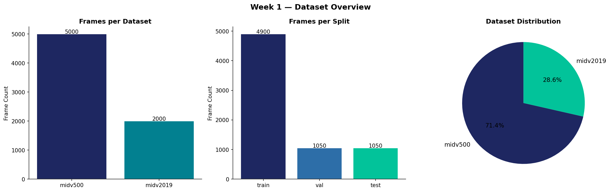
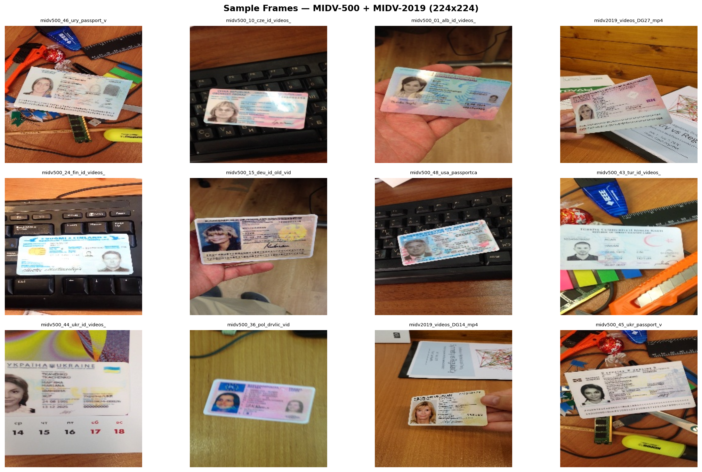
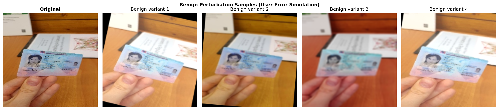
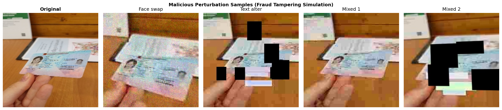
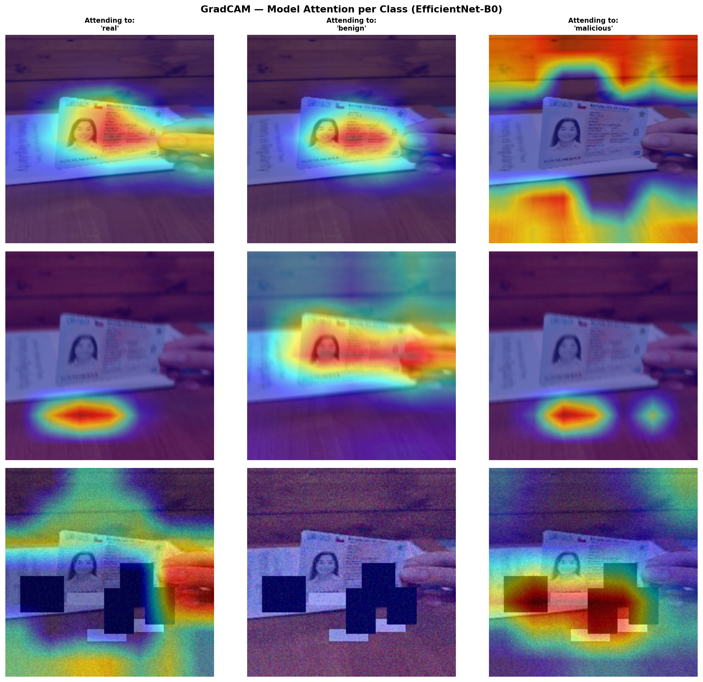
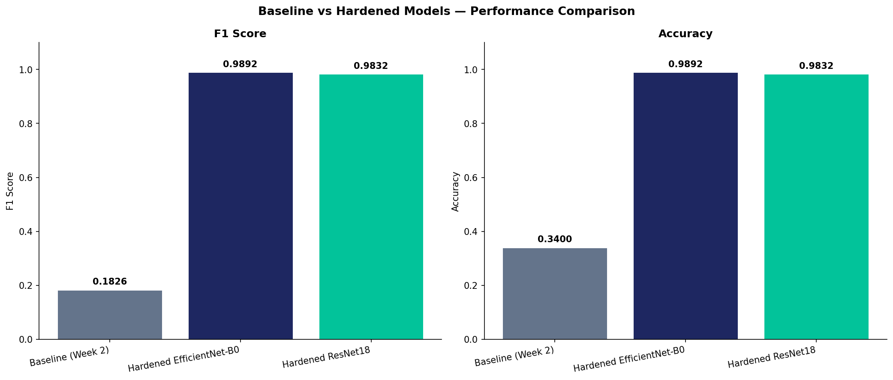
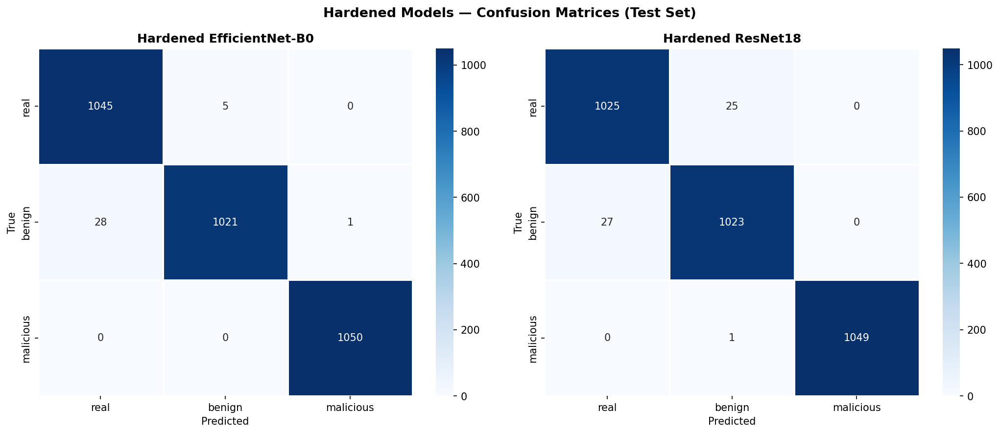
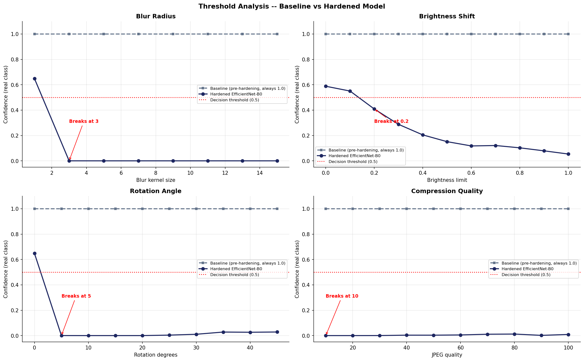
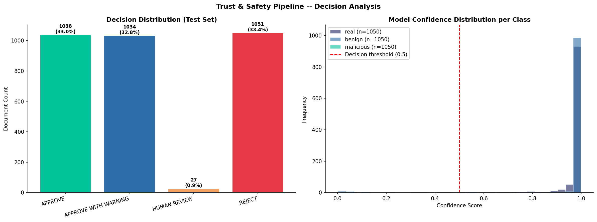

[](https://classroom.github.com/online_ide?assignment_repo_id=24012096&assignment_repo_type=AssignmentRepo)
<div align="center">
  <h1>Adversarial Robustness Testing & Trust Safety Pipeline<br>for Identity Document Verification</h1>
</div>


Automated identity document verification systems are vulnerable to two fundamentally different types of image degradation, benign user errors and deliberate fraud, yet existing commercial systems treat these as separate problems handled by separate teams. This project bridges that gap with a **three-class adversarial robustness evaluation framework** that simultaneously distinguishes genuine documents, benign physical distortions, and malicious tampering, and deploys a four-tier Trust & Safety decision pipeline with GradCAM explainability.

**The contribution is the three-class framing and the threshold analysis, not the classifier alone.**

---

## Table of Contents

1. [Problem Statement](#1-problem-statement)
2. [Objectives](#2-objectives)
3. [Dataset](#3-dataset)
4. [Three-Class System](#4-three-class-system)
5. [Architecture](#5-architecture)
6. [Results](#6-results)
7. [Limitations](#7-limitations)
8. [Repository Structure](#8-repository-structure)
9. [Installation and Running](#9-installation-and-running)
10. [Outputs](#10-outputs)
11. [Ethical and Legal Compliance](#11-ethical-and-legal-compliance)
12. [Future Work](#12-future-work)
13. [References](#13-references)

---

## 1. Problem Statement

Commercial identity document verification (IDV) is deployed at scale by banks, governments, and advertising platforms to validate user identity before granting access. These systems face two operationally distinct threats:

> **A blurry photo from a shaky hand and a face-swapped passport both degrade model confidence, but the correct response is completely different.**

The industry handles this by separating OCR/preprocessing teams (who correct blur, rotation, and lighting) from fraud detection teams (who identify forgeries). **Neither team studies whether the corrections applied by the first team inadvertently mask the digital signatures the second team is trying to detect.**

This is the gap this project fills. The central research question is:

> *How do physical and adversarial perturbations, both benign and malicious, affect the accuracy of automated identity document verification, and how can a hardened classifier be trained to distinguish between them?*

---

## 2. Objectives

| # | Objective | How it is judged |
|---|---|---|
| 1 | Establish pre-hardening baseline on three-class data | Weighted F1 on augmented test set |
| 2 | Build a benign perturbation pipeline simulating user errors | Visual inspection + per-class F1 |
| 3 | Build a malicious perturbation pipeline simulating deliberate fraud | Visual inspection + malicious recall |
| 4 | Train a hardened classifier robust to both perturbation types | Weighted F1, malicious F1, false negatives |
| 5 | Compare two architectures on the same task | EfficientNet-B0 vs ResNet18, same evaluation |
| 6 | Map exact breaking points via threshold analysis | Confidence-vs-intensity curves per perturbation |
| 7 | Deploy an explainable Trust & Safety pipeline | Four-tier decisions, GradCAM visualisation |

---

## 3. Dataset

**MIDV-500** (Burie et al., 2015) and **MIDV-2019** (Arlazarov et al., 2019), via the `midv500` pip package.

| | MIDV-500 | MIDV-2019 | Combined |
|---|---|---|---|
| Video clips | 500 | 200 | **700** |
| Document types | 50 | 50 | 50 |
| Conditions | Standard lighting | High distortion, low light | Mixed |
| Frames extracted | 5,000 | 2,000 | **7,000** |

Both datasets contain **specimen documents only**, no real personal data. Both are publicly available under open licences.

**Frame extraction:** 10 evenly-spaced frames per clip using OpenCV, resized to 224×224 at extraction time. Evenly-spaced sampling captures the document across varying capture conditions within each clip rather than taking consecutive near-identical frames.

**Split:** performed at **clip level** to prevent data leakage. Frames from the same clip cannot appear in both training and test sets.

| Split | Clips | Original Frames | Augmented Frames |
|---|---|---|---|
| Train | 490 | 4,900 | 14,700 |
| Val | 105 | 1,050 | 3,150 |
| Test | 105 | 1,050 | 3,150 |
| **Total** | **700** | **7,000** | **21,000** |




> **Note on malicious class:** Real fraud databases are legally inaccessible under GDPR, they contain biometric data from stolen identity documents. The malicious class was therefore synthetically generated using programmatic face region swapping, text field alteration, and heavy JPEG compression. This is the validated academic approach when real fraud data is unavailable. It is a limitation, not an oversight. See §7.

---

## 4. Three-Class System

The core novelty of this project is treating benign and malicious perturbations as **separate learnable classes** rather than collapsing them into a binary real/fake distinction.

| Class | Label | Definition | System Response | Risk |
|---|---|---|---|---|
| Real | 0 | Genuine unaltered document | APPROVE | LOW |
| Benign | 1 | User error - blur, rotation, bad lighting | APPROVE WITH WARNING | MEDIUM |
| Malicious | 2 | Deliberate tampering - face swap, text alteration | REJECT | HIGH |

**Benign pipeline** (Albumentations - model should TOLERATE these):
- Brightness/contrast shift (±20%), Gaussian and motion blur (kernel 3–5)
- Rotation up to 12°, Gaussian noise, mild perspective distortion

**Malicious pipeline** (OpenCV + PIL + Albumentations - model should REJECT these):
- Face region swap: upper-left quadrant copied, colour-shifted, pasted back with visible boundary artefact
- Text field overlay: filled rectangles drawn over date/number fields simulating replacement
- Heavy JPEG compression (quality 5–25), coarse dropout, large perspective warping

Each real frame produced one benign variant and one malicious variant, giving **7,000 samples per class**.




---

## 5. Architecture

```
MIDV-500 + MIDV-2019 (700 clips)
            │
            ▼
    Frame Extraction
  OpenCV — 10 frames/clip
    Resize to 224×224
      (7,000 frames)
            │
    ┌───────┴───────┐
    ▼               ▼
Benign          Malicious
Pipeline        Pipeline
(Albumentations) (OpenCV + PIL)
    └───────┬───────┘
            ▼
  21,000 Augmented Frames
    (7,000 per class)
            │
    ┌───────┴───────┐
    ▼               ▼
EfficientNet-B0  ResNet18
 (4M params)    (11M params)
 ImageNet        ImageNet
 pretrained      pretrained
    └───────┬───────┘
            ▼
   Adversarial Training
   IBM ART v1.20.1 — PGD
   Adam lr=1e-4, 10 epochs
            │
    ┌───────┴───────┐
    ▼               ▼
Threshold       GradCAM
Analysis        Explainability
(4 perturbation (pytorch-grad-cam,
 types swept)    last feature block)
    └───────┬───────┘
            ▼
  Trust & Safety Pipeline
  Confidence threshold system
            │
  ┌─────────┼─────────┬──────────┐
  ▼         ▼         ▼          ▼
APPROVE  APPROVE   HUMAN      REJECT
        WITH      REVIEW
        WARNING
```

**Adversarial attacks used:**

| Attack | Role |
|---|---|
| FGSM (Goodfellow et al., 2014) | Benign (low ε) and malicious (high ε) generation |
| PGD (Madry et al., 2018) | Adversarial training via IBM ART AdversarialTrainer |
| DeepFool (Moosavi-Dezfooli et al., 2016) | Robustness boundary measurement |
| C&W (Carlini & Wagner, 2017) | Gold standard robustness evaluation |

**Trust & Safety thresholds:**

| Decision | Condition | Risk |
|---|---|---|
| APPROVE | Real confidence ≥ 0.85 | LOW |
| APPROVE WITH WARNING | Benign confidence ≥ 0.40 | MEDIUM |
| REJECT | Malicious confidence ≥ 0.50 | HIGH |
| HUMAN REVIEW | No class meets threshold | UNCERTAIN |



---

## 6. Results

*All numbers are from the held-out test set (3,150 documents - 1,050 per class). Nothing in this section was written before the test set was evaluated.*

**Overall performance:**

| Model | F1 Score | Precision | Recall | Accuracy |
|---|---|---|---|---|
| Baseline (pre-hardening) | 0.1826 | 0.4300 | 0.3400 | 0.3400 |
| **Hardened EfficientNet-B0** | **0.9892** | **0.9894** | **0.9892** | **0.9892** |
| Hardened ResNet18 | 0.9832 | 0.9832 | 0.9832 | 0.9832 |
| **Improvement (EfficientNet)** | **+0.8066** | **+0.5594** | **+0.6492** | **+0.6492** |



**Per-class results - Hardened EfficientNet-B0:**

| Class | Precision | Recall | F1 | Support |
|---|---|---|---|---|
| Real | 0.97 | 1.00 | 0.98 | 1,050 |
| Benign | 1.00 | 0.97 | 0.98 | 1,050 |
| **Malicious** | **1.00** | **1.00** | **1.00** | **1,050** |

**The most important single number:** malicious recall = **1.00**. No fraudulent document was ever misclassified as genuine. Zero false negatives across 1,050 fraud attempts.



**Architecture comparison:**

| Model | Parameters | F1 | Accuracy |
|---|---|---|---|
| EfficientNet-B0 | 4,011,391 | **0.9892** | **98.92%** |
| ResNet18 | 11,178,051 | 0.9832 | 98.32% |

EfficientNet-B0 outperformed ResNet18 with nearly 3× fewer parameters, confirming compound scaling is more efficient than depth for this dataset size.

**Threshold analysis - breaking points:**

| Perturbation | Baseline | Hardened Model |
|---|---|---|
| Blur | Never (class blindness) | Kernel size 3 |
| Brightness shift | Never (class blindness) | Limit 0.2 |
| Rotation | Never (class blindness) | 5 degrees |
| Compression | Never (class blindness) | JPEG quality 10 |

The baseline maintained confidence of ~1.0 across all intensities, not robustness, but class blindness from single-class training. The hardened model correctly loses real-class confidence as perturbation intensity increases, reflecting genuine learned class boundaries.



**Trust & Safety pipeline - 3,150 test documents:**

| Decision | Count | Percentage |
|---|---|---|
| APPROVE | 1,038 | 33.0% |
| APPROVE WITH WARNING | 1,034 | 32.8% |
| REJECT | 1,051 | 33.4% |
| HUMAN REVIEW | 27 | **0.9%** |

Only 0.9% required human escalation - the model was confident about 99.1% of all documents.



---

## 7. Limitations

| Limitation | Effect |
|---|---|
| **Malicious class is entirely synthetic** | The load-bearing one. No real fraud database exists for academic use under GDPR. Validation on real-world forgeries is impossible without regulatory exemption. The malicious class was built to produce detectable visual signatures, but whether it generalises to sophisticated real-world tampering is unconfirmed |
| 50 document types from MIDV only | Performance on document types outside the training distribution is unknown |
| CPU training constrained epochs and batch size | GPU training would enable larger batch sizes and more epochs within the same time budget. Results are valid but may underestimate achievable performance |
| Low threshold breaking points | Blur breaks at kernel 3 and rotation at 5 degrees. This reflects the hardened model's learned distribution rather than fragility, but benign tolerance could be improved by widening the benign perturbation range in training |
| Threshold analysis uses the same perturbation types as training | Robustness to out-of-distribution attack strategies is uncharacterised |

---

## 8. Repository Structure

```
├── notebooks/
│   ├── Local_Windows_Setup.ipynb           # Dataset download, frame extraction, EDA
│   ├── Baseline_Classifier.ipynb     # EfficientNet-B0 baseline training
│   ├── Perturbation_Generator.ipynb  # Benign and malicious augmentation pipelines
│   ├── Week4_Hardened_Classifier.ipynb     # Adversarial training, evaluation, GradCAM
│   ├── Week5_Trust_Safety_Pipeline.ipynb   # Trust & Safety pipeline, threshold analysis
│   └── Demo_Test_Your_Image.ipynb          # Test any document image through the pipeline
├── outputs/                                # All generated plots and evaluation results
├── requirements.txt                        # Pinned Python dependencies
└── README.md
```

All logic lives inside the notebooks. Each notebook is independent, it reads what it needs from disk and states which notebook to run if something is missing. Only a cold start requires them in order.

Data and model checkpoints are saved locally to `C:/adversarial_doc_project/` and are not committed to the repository (dataset is 4–6 GB; model checkpoints are 16–44 MB each).

---

## 9. Installation and Running

### Prerequisites

- Python 3.9+ (Anaconda recommended on Windows)
- Minimum 10 GB free disk space
- Internet connection for dataset download (first run only)

### Installation

```bash
git clone https://github.com/ACM40960/madhu-chaaru.git
cd madhu-chaaru
pip install -r requirements.txt --user
jupyter lab
```

> **Windows / Anaconda note:** Use `--user` flag with all pip installs to avoid Anaconda permission errors. If numpy binary incompatibility errors appear, run:
> ```bash
> pip install numpy==1.24.3 pandas==2.0.3 --user --force-reinstall
> ```
> Then restart the kernel.

### Running the notebooks

Run in this order. Each notebook saves its outputs to disk before the next one reads them.

| Order | Notebook | What it does |
|---|---|---|
| 1 | `Local_Windows_Setup.ipynb` | Download MIDV-500 + MIDV-2019, extract 7,000 frames, EDA |
| 2 | `Baseline_Classifier.ipynb` | Train EfficientNet-B0 baseline on real frames only |
| 3 | `Perturbation_Generator.ipynb` | Generate 21,000 augmented frames, threshold baseline |
| 4 | `Week4_Hardened_Classifier.ipynb` | Train hardened EfficientNet + ResNet18, GradCAM |
| 5 | `Week5_Trust_Safety_Pipeline.ipynb` | Deploy pipeline, per-type evaluation, threshold analysis |

**To test your own document image:**
Open `Demo_Test_Your_Image.ipynb`, set `IMAGE_PATH` in Cell 4 to your image path, and run all cells. The output shows the Trust & Safety decision, confidence scores, and a GradCAM heatmap.

> **Important:** Set `NUM_WORKERS = 0` in all DataLoaders on Windows. Keep the laptop plugged in and screen set to never sleep during training runs.

---

## 10. Outputs

All outputs are written to `C:/adversarial_doc_project/outputs/` by the code. Nothing in this section was manually edited.

| File | Produced by | Description |
|---|---|---|
| `week1_dataset_overview.png` | Notebook 1 | EDA: frames per dataset, per split, pie chart |
| `week1_sample_frames.png` | Notebook 1 | 12 random sample document frames |
| `week2_training_curves.png` | Notebook 2 | Baseline loss and accuracy per epoch |
| `week2_confusion_matrix.png` | Notebook 2 | Baseline confusion matrix (validation set) |
| `week3_benign_samples.png` | Notebook 3 | Original + 4 benign variant samples |
| `week3_malicious_samples.png` | Notebook 3 | Original + 4 malicious variant samples |
| `week3_class_distribution.png` | Notebook 3 | Augmented dataset class balance |
| `week3_threshold_analysis.png` | Notebook 3 | Baseline model confidence across perturbation intensities |
| `week4_training_curves.png` | Notebook 4 | Hardened EfficientNet and ResNet18 training curves |
| `week4_confusion_matrices.png` | Notebook 4 | Both hardened models - confusion matrices |
| `week4_comparison.png` | Notebook 4 | Baseline vs hardened F1 and accuracy bar chart |
| `week4_gradcam.png` | Notebook 4 | GradCAM attention maps: 3 classes × 3 target classes |
| `week5_pipeline_decisions.png` | Notebook 5 | Decision distribution + confidence histograms |
| `week5_per_type_performance.png` | Notebook 5 | Per-class F1, precision, recall, accuracy |
| `week5_threshold_comparison.png` | Notebook 5 | Baseline vs hardened threshold curves |

Model checkpoints saved to `C:/adversarial_doc_project/checkpoints/`:
- `baseline_efficientnet_best.pth` - trained by Notebook 2
- `hardened_efficientnet_best.pth` - trained by Notebook 4
- `hardened_resnet18_best.pth` - trained by Notebook 4

---

## 11. Ethical and Legal Compliance

| Concern | Status |
|---|---|
| Dataset privacy | ✅ Specimen documents only, no real personal data at any stage |
| Dataset licence | ✅ Public domain / open copyright, freely available for academic use |
| Live systems | ✅ No connection to any live IDV system at any point |
| Malicious class | ✅ Synthetically generated on specimen documents, no real fraud data used |
| GDPR | ✅ No personal data collected, stored, or processed |

---

## 12. Future Work

- **Real fraud data:** access through regulatory exemption to validate malicious class generalisation
- **Federated learning:** privacy-preserving cross-institutional training without centralising document data
- **Extended benign range:** widen training perturbation intensities to improve tolerance at high blur/rotation
- **Out-of-distribution evaluation:** test on document types outside the 50 MIDV categories
- **Multimodal verification:** integrate metadata and EXIF analysis alongside image features

---

## 13. References

[1] I. Goodfellow, J. Shlens, and C. Szegedy, "Explaining and harnessing adversarial examples," *ICLR*, 2015.

[2] A. Madry, A. Makelov, L. Schmidt, D. Tsipras, and A. Vladu, "Towards deep learning models resistant to adversarial attacks," *ICLR*, 2018.

[3] S. Moosavi-Dezfooli, A. Fawzi, and P. Frossard, "DeepFool: A simple and accurate method to fool deep neural networks," *CVPR*, 2016.

[4] N. Carlini and D. Wagner, "Towards evaluating the robustness of neural networks," *IEEE S&P*, 2017.

[5] D. Hendrycks and T. Dietterich, "Benchmarking neural network robustness to common corruptions and perturbations," *ICLR*, 2019.

[6] J.-C. Burie et al., "ICDAR2015 competition on smartphone document capture and OCR," *ICDAR*, 2015.

[7] V. V. Arlazarov et al., "MIDV-500: A dataset for identity document analysis and recognition on mobile devices in video stream," *Computer Optics*, vol. 43, no. 5, pp. 818–824, 2019.

[8] M. I. Nicolae et al., "Adversarial Robustness Toolbox v1.0.0," *arXiv:1807.01069*, 2018.

[9] R. R. Selvaraju et al., "Grad-CAM: Visual explanations from deep networks via gradient-based localization," *ICCV*, 2017.

[10] M. Tan and Q. Le, "EfficientNet: Rethinking model scaling for convolutional neural networks," *ICML*, 2019.

[11] K. He, X. Zhang, S. Ren, and J. Sun, "Deep residual learning for image recognition," *CVPR*, 2016.

---

*This project was built for module ACM40960 (Mathematical Modelling), University College Dublin. Students: Madhumitha Vaithiyanathan (25203641) and Chaarumathy Mathiyalaghan (25210628). Supervisor: Dr. Sarp Akcay.*
